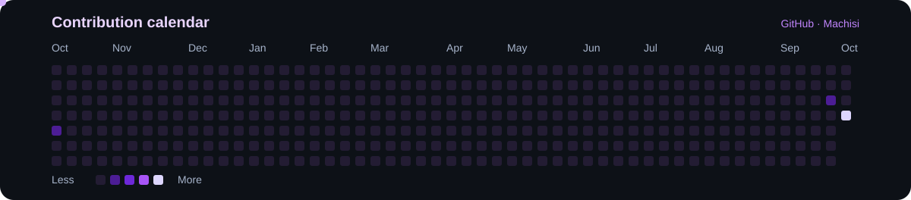

  

<h1 align="center">Hi, I'm Marc 👋</h1>

  Double degree student in Computer Engineering and Business Administration and Management at Universitat Politècnica de València. 
  I enjoy building projects where software, data, and business meet.

  
  

---

## 👨‍💻 About

I'm Marc, based in Valencia, Spain. I study Computer Engineering and Business Administration and Management at UPV. My projects involve **Python and Java**, data analysis, and business problems. I'm also interested in **cybersecurity**, **applied AI**, and collaborative projects.

- 🎓 Double degree in Computer Engineering + Business Administration and Management · UPV
- 📍 Valencia, Spain
- 📊 Interests: data, business, technology, and sports strategy
- 🤝 I document both the outcome and my own contribution to team projects

## 🛠️ Tech Stack

  

Python · Java · HTML · Git/GitHub · Excel for analysis

## 🤖 AI & ML Expertise

My published work focuses more on **data analysis and prototypes** than on machine learning models I have trained myself. Here are the areas I can demonstrate today:

| Area | What I've worked on | Evidence |
| :--- | :--- | :--- |
| Quantitative analysis | Historical data, strategy rules, and evaluation of results | [SMA Backstrategy](https://github.com/Machisi/SMA-Backstrategy-) |
| Applied AI in a team | Exploring an application with local AI components in shared team repositories | [ONE: backend](https://github.com/Machisi/one), [web](https://github.com/Machisi/one-frontend), and [iOS](https://github.com/Machisi/one-ios) |
| Machine learning | An area I plan to develop in future projects | Independent project to be published |

## 🚀 Featured Projects

| Project | Description |
| :--- | :--- |
| 📈 [SMA Backstrategy](https://github.com/Machisi/SMA-Backstrategy-) | Python backtest of a moving average strategy using historical market data. |
| 🧩 [ONE](https://github.com/Machisi/one) · [frontend](https://github.com/Machisi/one-frontend) · [iOS](https://github.com/Machisi/one-ios) | Team project with a backend, web interface, and iOS app. These links point to forks of the shared repositories. |
| ☕ [Java coursework](https://github.com/Machisi/Practica2.1) | University programming assignment. |

<!-- Add the Invest hackathon when the repository/demo link, challenge, result, and your own contribution are available.
     Add new university projects once they are published.
     Keep the F1 project out until its exposed key has been revoked and removed from the repository history. -->

## 🏅 Certifications & Learning

| Certificate | Issuer | Date |
| :--- | :--- | :--- |
| [Certified in Cybersecurity (CC) · certificate of completion](./assets/certificates/isc2-cc-2025-public.pdf) | ISC2 | May 16, 2025 |
| [Getting Started with Cisco Packet Tracer](./assets/certificates/cisco-packet-tracer-getting-started-2025.pdf) | Cisco Networking Academy | November 26, 2025 |
| [Exploring Networking with Cisco Packet Tracer](./assets/certificates/cisco-packet-tracer-networking-2025.pdf) | Cisco Networking Academy | November 26, 2025 |
| [Exploring IoT with Cisco Packet Tracer](./assets/certificates/cisco-packet-tracer-iot-2025.pdf) | Cisco Networking Academy | November 26, 2025 |

The three Cisco documents confirm course completion. The public ISC2 copy hides the learner ID.

## 📊 GitHub Analytics

  

  
  

  

These cards show public activity. Forks and private repositories can affect each counter differently.

## 🐍 Contribution Snake

A purple snake travels across my GitHub contribution calendar. Choose a year to see its animation.

<!-- contribution-calendar:start -->
<table><tr><td width="90%" valign="top">

</td><td valign="top"><strong>Years</strong> 
<strong>2026</strong> 
<a href="https://raw.githubusercontent.com/Machisi/machisi/main/assets/contribution-snake-2025.svg">2025</a> 
<a href="https://raw.githubusercontent.com/Machisi/machisi/main/assets/contribution-snake-2024.svg">2024</a>
</td></tr></table>
<!-- contribution-calendar:end -->

---

Thanks for visiting my profile. Explore my projects or connect with me on LinkedIn.

